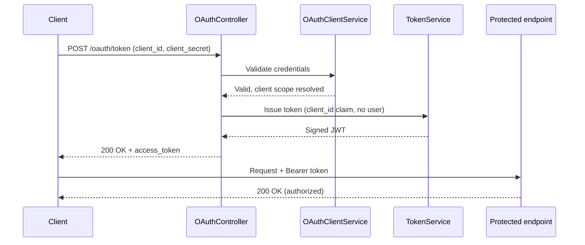
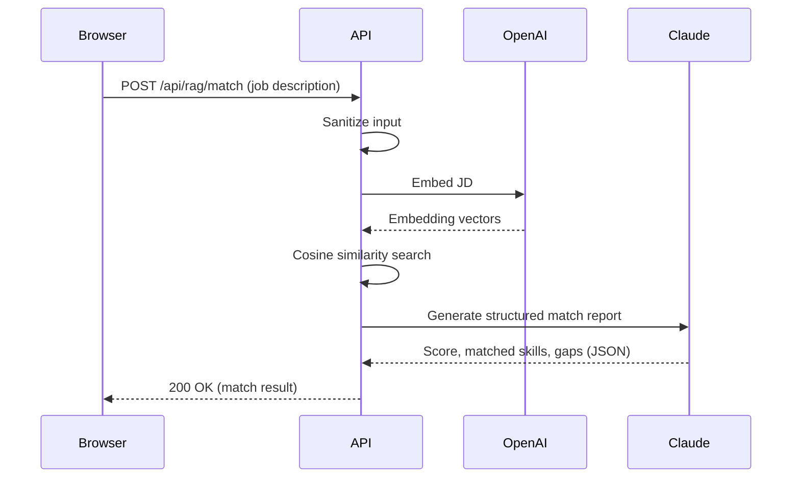

# LampLightLabs.JobSearch.Api

A personal ASP.NET Core Web API project built by **Michael Sargent** to dust off and sharpen API development skills following a career transition in early 2026.

---

## Table of Contents

- [What This Project Does](#what-this-project-does)
- [Endpoints](#endpoints)
- [Authentication](#authentication)
- [CORS and Rate Limiting](#cors-and-rate-limiting)
- [API Versioning](#api-versioning)
- [Async Job Pattern](#async-job-pattern---how-it-works)
- [RAG Pipeline](#rag-pipeline---how-it-works)
- [Frontend](#frontend)
- [Project Structure](#project-structure)
- [Tech Stack](#tech-stack)
- [Running Locally](#running-locally)
- [Key Design Decisions](#key-design-decisions)
- [Author](#author)

---

## What This Project Does

This project serves ten purposes:

**1. Job Search Pipeline Tracker**
The `ApplicationsController` reads a CSV file containing job applications and their current pipeline states, exposing that data via a REST endpoint. It uses CsvHelper to correctly handle quoted multi-line fields - a real-world parsing challenge solved during development.

**2. Async Long-Running Job Pattern (Exercise)**
The `JobsController` demonstrates a production-relevant API pattern: accepting a long-running request, returning a job ID immediately with `202 Accepted`, processing work asynchronously in the background, and exposing a polling endpoint the client can call to check job status. This pattern is common in compliance processing, batch operations, and file export workflows. Job records are persisted via EF Core against Postgres (`EfJobStore`), with the original in-memory implementation (`JobStore`) kept alongside it — both implement `IJobStore`, the same Strategy Pattern used for `ICsvReaderService` below, and swapping which one is registered in `Program.cs` is a one-line change. Moving to a Scoped `DbContext` surfaced a real DI-lifetime bug in the background task: it previously reused the controller's own injected store directly, which only worked because that store was Singleton. `JobsController` now injects `IServiceScopeFactory` and creates a fresh scope inside the background method, so fire-and-forget work gets its own Scoped instances instead of risking a disposed `DbContext` once the originating HTTP request's scope ends.

**3. Authentication Showcase**
Each endpoint in the project demonstrates a different authentication scheme: JWT Bearer, API Key, Basic Auth, and OAuth 2.0 Client Credentials. This mirrors real-world backend APIs where different consumers (users, services, integrations) require different auth patterns on different endpoints.

**4. Idempotency (Exercise)**
`POST /api/v2/applications` demonstrates idempotent write operations using a caller-supplied `Idempotency-Key` header and SHA-256 request fingerprinting. The server caches the response on first call and replays it on retry - no duplicate record is created. Key reuse on a different payload returns 422. This pattern is critical in payment processing, compliance workflows, and any distributed system where a request may fire more than once.

**5. Characterization Testing (Exercise)**
`StatusCategorizerService` was extracted from a private controller method and covered with characterization tests before any refactoring was attempted. Following Michael Feathers' approach from "Working Effectively with Legacy Code" - freeze what the code actually does, not what it should do, then refactor safely inside that safety net.

**6. Threading Concepts (Exercise)**
Two tests in `RaceConditionDemoTests` demonstrate race condition behavior and its fix. The broken version spins up two threads incrementing a shared counter without synchronization - at 1 million iterations the result is reliably short of 2 million, proving the lost update. The fixed version wraps the increment in a `lock` block with a shared lock object and produces exactly 2 million every time. `ProcessApplicationsAsync` in `JobsController` also demonstrates `CancellationToken` wired into a long-running async operation - the delay is cancellation-aware and the token is checked before CSV processing begins so the operation exits cleanly at a safe boundary.

**7. AI Integration (Exercise)**
`POST /api/v2/ai/chat` accepts a JSON body with a `prompt` field and forwards it to the Anthropic Claude API via the official Anthropic .NET SDK, returning Claude's text response. `IClaudeChatService` wraps the SDK call behind an interface, consistent with the interface-based DI pattern used throughout the project, which keeps the controller and its tests free of any direct dependency on the SDK. The API key is configured under `Anthropic:ApiKey` in `appsettings.json` and overridden locally via .NET user secrets - it is never committed.

**8. Semantic Kernel Integration (Exercise)**
`POST /api/v2/sk/chat` accepts a JSON body with a `prompt` field and forwards it to an OpenAI chat completion model through Microsoft Semantic Kernel's OpenAI connector, returning the model's text response. `ISemanticKernelChatService` builds and wraps the Semantic Kernel `Kernel` behind an interface - the same pattern used for `IClaudeChatService` - so the controller and its tests have no direct dependency on Semantic Kernel or OpenAI. This mirrors a real-world scenario where an application swaps or runs multiple LLM orchestration frameworks side by side. The API key is configured under `OpenAI:ApiKey` in `appsettings.json` and overridden locally via .NET user secrets - it is never committed.

**9. CORS and Rate Limiting (Exercise)**
A `ViteDev` CORS policy allows `http://localhost:5173` (the Vite dev server default) to make cross-origin requests, with any method and header permitted so the React frontend can send `Authorization`, `Content-Type`, and `Idempotency-Key` preflight checks without being blocked by the browser. Three named rate limiting policies use ASP.NET Core 8's built-in `AddRateLimiter` (no additional NuGet packages): a fixed window on token issuance endpoints to prevent credential stuffing, a sliding window on general data endpoints for smooth per-user throttling, and a token bucket on LLM inference endpoints to meter expensive AI calls. All three policies partition by authenticated user identity (`name` or `client_id` claim) with a fallback to remote IP for anonymous requests, so each caller gets an independent counter. Rejected requests return HTTP 429 with a `Retry-After` header. Limits are config-driven under `Cors` and `RateLimiting` in `appsettings.json`. The middleware order is intentional: `UseRouting` is called explicitly before `UseRateLimiter` so endpoint metadata (the `[EnableRateLimiting]` attributes) is resolved before the rate limiter runs; `UseCors` comes before `UseAuthentication` so browser preflight OPTIONS requests are not challenged for credentials; `UseRateLimiter` comes after `UseAuthorization` so `HttpContext.User` is populated when the partition key is computed.

**10. RAG Pipeline (Exercise)**
`POST /api/rag/match` accepts the full text of a job description and returns a structured match analysis against the resume: a match score (0–100), a 2–3 sentence narrative, identified strengths, gaps, and the specific resume chunks that informed the analysis. Input sanitization happens in two layers: `NewlineSanitizingMiddleware` runs first and replaces literal `\r\n`, `\r`, and `\n` characters in the raw JSON body with spaces before the JSON deserializer sees them (unescaped newlines inside a JSON string value are illegal per RFC 8259 and would cause a parse error before the request reaches any controller), then the controller strips non-printable control characters, normalizes any remaining line endings, collapses horizontal whitespace runs, and caps consecutive blank lines at two, so the LLM always receives clean input regardless of how the client serialized the text. At startup, `ResumeVectorStoreService` (a `BackgroundService`) splits the resume into sections, embeds each one using OpenAI's `text-embedding-3-small` model, and holds the vectors in memory. On each request, the sanitized job description is embedded, cosine similarity retrieves the top-3 most relevant resume sections, and those sections are injected into a structured prompt sent to Claude via the Anthropic API. Claude returns a raw JSON object; the service deserializes it and attaches `retrievedContext` from the vector store rather than trusting the model to report which chunks it used. `IPromptRepository` owns all prompt construction — system instructions and user message assembly are separated from orchestration logic so prompts can be reviewed, swapped, or tested independently. Requires `OpenAI:ApiKey` (embeddings) and `Anthropic:ApiKey` (generation) set in user secrets.

---

## Endpoints

### Auth
| Method | Route | Auth | Description |
|---|---|---|---|
| POST | `/api/v1/auth/token` | None | Accepts username/password, returns a signed JWT bearer token |
| POST | `/oauth/token` | None | Accepts client_id/client_secret (form), returns a client-scoped JWT (OAuth 2.0 Client Credentials) |

### Applications
| Method | Route | Version | Auth | Description |
|---|---|---|---|---|
| GET | `/api/v1/applications/fromcsv` | v1 | None | Returns raw job application records from the pipeline CSV |
| GET | `/api/v2/applications/fromcsv` | v2 | JWT Bearer | Returns enriched records with calculated pipeline intelligence fields |
| GET | `/api/v2/applications/status` | v2 | API Key | Returns lightweight pipeline status confirming the API is operational |
| GET | `/api/v2/applications/count` | v2 | Basic Auth | Returns the total count of applications in the pipeline CSV |
| GET | `/api/v2/applications/stats` | v2 | JWT Bearer (OAuth) | Returns aggregate pipeline statistics: totals, breakdowns, averages |
| POST | `/api/v2/applications` | v2 | JWT Bearer | Creates a new application record. Requires `Idempotency-Key` header. Replays cached response on retry. Returns 422 if key is reused with a different body. |

### Jobs
| Method | Route | Version | Auth | Description |
|---|---|---|---|---|
| POST | `/api/v1/jobs/start` | v1 | None | Starts a background job, returns job ID immediately |
| GET | `/api/v1/jobs/{jobId}/status` | v1 | None | Polls the status of a running or completed job |

> Job records are persisted via EF Core to Postgres (`EfJobStore`) in production. Requires a local Postgres instance and an applied migration — see **Running Locally**. Every other endpoint in this project works without Postgres running.

### AI
| Method | Route | Auth | Description |
|---|---|---|---|
| POST | `/api/v2/ai/chat` | None | Accepts `{ "prompt": "..." }` and returns Claude's response via the Anthropic .NET SDK |
| POST | `/api/v2/sk/chat` | None | Accepts `{ "prompt": "..." }` and returns an OpenAI model's response via Microsoft Semantic Kernel |

### RAG
| Method | Route | Auth | Description |
|---|---|---|---|
| POST | `/api/rag/match` | None | Accepts a job description and returns a structured resume match analysis: score (0–100), narrative summary, strengths, gaps, and the retrieved resume chunks |
| GET | `/api/rag/usage` | None | Returns the current calendar month's logged usage: total estimated cost, percent of the soft monthly budget used, and whether the hard ceiling has been hit. Exempt from rate limiting (`[DisableRateLimiting]`) since it's a cheap read that shouldn't compete with the `ai-token-bucket` budget meant for actual match calls |

**Request: POST /api/rag/match**
```json
{
  "jobDescription": "We are looking for a Senior .NET Engineer with Azure experience..."
}
```

> Requires `OpenAI:ApiKey` (embeddings via `text-embedding-3-small`) and `Anthropic:ApiKey` (generation via Claude) set in user secrets. See **Running Locally** for setup.

> **Upstream failures never reach the client raw.** If the Anthropic or OpenAI call underneath any of the three AI endpoints above fails (quota/billing exhaustion, rate limit, 5xx), the full exception is logged server-side and the client gets back a generic message — `429` for a genuine rate limit, `503` otherwise — never the SDK's raw exception text (which can carry account IDs, usage figures, or billing-page links) or a stack trace. `/api/rag/match`'s `503` also sets `"tryDemo": true` so the frontend can point a visitor at the demo instead of a dead end. See **Key Design Decisions**.

> **Cost safety net.** Every real (non-demo) `/api/rag/match` call that actually runs the pipeline logs an estimated cost via `IUsageTrackingService`, backed by a new `UsageLogs` table (same `JobSearchDbContext`/Postgres setup as everything else — no new infrastructure). `UsageTracking:DemoModeOnly` (config, defaults `true`) and a hard-ceiling circuit breaker (`UsageTracking:MonthlyHardCeilingUsd`, checked against the current month's logged total) both short-circuit `/api/rag/match` to the same `503 { tryDemo: true }` response described above — without calling the real pipeline or logging a cost — via one decision point, `IUsageTrackingService.ShouldServeDemoAsync`. That check fails closed: if the usage query itself fails, it serves demo rather than risk unmetered spend. `DemoModeOnly` must be verified and flipped to `false` manually after confirming tracking works in production; it does not flip itself. See **Key Design Decisions**.

**Response:**
```json
{
  "matchScore": 82,
  "summary": "Strong fit for a senior .NET backend role. Candidate brings 26 years of C# and Azure experience directly aligned with the core requirements. Minor gaps in Kubernetes and container orchestration.",
  "strengths": [
    "26 years C#/.NET experience across enterprise and federal domains",
    "Azure DevOps, Azure Functions, and cloud-native architecture",
    "REST API design, SQL Server, and microservices patterns"
  ],
  "gaps": [
    "No explicit Kubernetes or container orchestration experience",
    "Limited frontend/React experience"
  ],
  "retrievedContext": [
    "RECENT EXPERIENCE section: Principal Engineer at ...",
    "TECHNICAL SKILLS section: C#, .NET 8, Azure, ...",
    "PROFESSIONAL SUMMARY section: ..."
  ]
}
```

---

## Authentication

This project demonstrates four authentication schemes, each protecting a different endpoint to illustrate real-world usage patterns.

### JWT Bearer
Standard user-facing auth. POST credentials to `/api/v1/auth/token`, receive a signed JWT, pass it as `Authorization: Bearer {token}` on protected requests.

- Protected endpoints: `GET /api/v2/applications/fromcsv`, `GET /api/v2/applications/stats`
- Token issued by `TokenService`, validated by ASP.NET Core JWT Bearer middleware
- Key, issuer, audience, and expiry configured in `appsettings.json` under `Jwt`

### API Key
Service-to-service auth where a shared secret is passed in the request header. No token issuance - the key is validated on every request.

- Protected endpoint: `GET /api/v2/applications/status`
- Implemented as `ApiKeyAuthAttribute` (IAuthorizationFilter) - keeps auth logic out of the controller
- Key configured in `appsettings.json` under `ApiKey`
- Header: `Authorization: ApiKey {key}`

### Basic Auth
Legacy/simple auth scheme. Credentials are Base64-encoded and passed in the Authorization header on every request.

- Protected endpoint: `GET /api/v2/applications/count`
- Implemented as `BasicAuthHandler` chained onto the existing JWT scheme without overwriting it
- Credentials configured in `appsettings.json` under `BasicAuth`
- Header: `Authorization: Basic {base64(username:password)}`

### OAuth 2.0 Client Credentials
Machine-to-machine auth. A client application authenticates with its client_id and client_secret to receive a JWT. No user context - the token represents the application, not a person.

- Protected endpoint: `GET /api/v2/applications/stats`
- Token endpoint: `POST /oauth/token` (outside versioning - auth infrastructure does not belong to a version)
- Request format: `application/x-www-form-urlencoded` per the OAuth 2.0 spec
- Clients configured in `appsettings.json` under `OAuthClients`
- Token claims: `sub` (clientId), `client_id`, `scope`, `jti`, `exp`



---

## CORS and Rate Limiting

### CORS

The `ViteDev` policy (named for its original dev-only purpose; the name wasn't updated when production origins were added) is registered via `AddCors` and applied globally with `UseCors("ViteDev")`. It permits the Vite dev server (`http://localhost:5173`), the production frontend's custom domain (`https://match.lamplightlabs.com`), and the underlying Azure Static Web Apps origin (`https://blue-coast-05842a60f.7.azurestaticapps.net`) — and allows any method and header.

Allowed origins are config-driven under `Cors:AllowedOrigins` in `appsettings.json`, so additional origins (e.g. a staging frontend) can be added without a code change.

### Rate Limiting

Three named policies are registered via `AddRateLimiter` using ASP.NET Core 8's built-in rate limiting — no additional packages required.

| Policy | Algorithm | Default limits | Applied to |
|---|---|---|---|
| `auth-fixed` | Fixed window | 10 req / 60s, no queue | `POST /api/v1/auth/token`, `POST /oauth/token` |
| `api-sliding` | Sliding window | 100 req / 60s, 4 segments, no queue | All Applications and Jobs endpoints |
| `ai-token-bucket` | Token bucket | Burst 5, +2 per 30s, queue 2 | `/api/v2/ai/chat`, `/api/v2/sk/chat`, `/api/rag/match` |

**Partition key:** Each policy partitions by authenticated user identity (`name` claim for user JWTs, `client_id` claim for client-credential JWTs). Anonymous requests fall back to remote IP. This means each caller gets an independent counter — a user hitting the limit does not affect any other user.

**Rejected responses:** HTTP 429 with a plain-text body and a `Retry-After` header set to the remaining window seconds.

**Configuration:** All limits live under `RateLimiting` in `appsettings.json` and are read at startup with in-code defaults as fallback. Tuning a limit is a config change with no rebuild required.

**Middleware order:**
```
UseRouting()        ← explicit; UseRateLimiter needs endpoint metadata resolved first
UseCors()           ← before auth; preflight OPTIONS must not require credentials
UseAuthentication()
UseAuthorization()
UseRateLimiter()    ← after auth; HttpContext.User is populated for partition key
MapControllers()
```

---

## API Versioning

This project uses URL segment versioning via the `Asp.Versioning.Mvc` library.

- Version is embedded in the URL path: `/api/v1/...`, `/api/v2/...`
- Unversioned requests default to v1
- Supported versions are reported in the `api-supported-versions` response header
- Swagger UI reflects both version definitions in the dropdown

### What Changed Between V1 and V2

**V1** returns raw CSV data as-is. No transformation, no calculation.

**V2** returns the same base fields plus three calculated fields:

| Field | Type | Description |
|---|---|---|
| `daysInPipeline` | int | Number of days since the application was submitted |
| `isFollowUpToday` | bool | True if the follow-up date matches today |
| `statusCategory` | string | Derived grouping: Active, OnHold, or Closed |

This mirrors a real-world versioning scenario - V1 consumers continue working unchanged while V2 consumers get enriched data with business logic applied server-side.

---

## Async Job Pattern - How It Works
```
Client                          Server
|                               |
|-- POST /api/v1/jobs/start --->|  Returns 202 Accepted + jobId immediately
|<-- { jobId, status: Queued } -|  Background work starts (CancellationToken wired in)
|                               |
|-- GET /api/v1/jobs/{id}/status|  Poll #1
|<-- { status: Processing } ----|
|                               |
|-- GET /api/v1/jobs/{id}/status|  Poll #2 (after delay)
|<-- { status: Complete,        |
|      result: "Processed 29    |
|      applications" }          |
```

The background task accepts a `CancellationToken`. The 3-second delay is cancellation-aware (`Task.Delay(3000, cancellationToken)`), and the token is checked again before CSV processing begins. The operation exits cleanly at a safe boundary rather than being interrupted mid-work.

---

## RAG Pipeline - How It Works
```
Startup
  ResumeVectorStoreService (BackgroundService)
  └── Loads resume.txt, splits on ---
  └── Embeds each chunk via OpenAI text-embedding-3-small
  └── Stores (chunk, embedding[]) in memory
  └── Signals ready via TaskCompletionSource

Request: POST /api/rag/match { "jobDescription": "..." }
  │
  ├─ 1. GetRelevantChunksAsync(jobDescription, topK: 3)
  │       Embeds the job description
  │       Cosine similarity against all stored resume chunks
  │       Returns top-3 chunks
  │
  ├─ 2. IPromptRepository.BuildRagMatchUserMessage(jd, chunks)
  │       Assembles: Job Description + Resume Context
  │
  ├─ 3. IClaudeChatService.SendPromptAsync(systemPrompt, userMessage)
  │       System: "Return only raw JSON: matchScore, summary, strengths, gaps"
  │       Returns raw JSON string
  │
  ├─ 4. JsonSerializer.Deserialize → LlmMatchResult
  │
  └─ 5. Return RagMatchResponse
          matchScore, summary, strengths, gaps  ← from Claude
          retrievedContext                       ← from vector store (step 1)
```



---

## Frontend

The `client/` directory contains **Resume Match Analyzer**, a React + TypeScript + Vite single-page app that calls the real `POST /api/rag/match` endpoint documented above — it does not compute or fake anything client-side (demo mode, below, is the one deliberate exception).

### Deployment

The frontend deploys to **Azure Static Web Apps**, with a GitHub Actions workflow (`.github/workflows/azure-static-web-apps-blue-coast-05842a60f.yml`) that builds and deploys on every push to `main`. This is the same push-to-`main` CI/CD pattern the backend uses for its own deployment to Azure Web App (`.github/workflows/main_lamplightlabs-api.yml`) — both halves of this project ship the same way.

**Flipping `DemoModeOnly` off in production** (see **Usage tracking, the demo toggle, and the cost circuit breaker share one decision point** in Key Design Decisions) is deliberately an Azure CLI action, not an in-app control or admin endpoint — nothing reachable by a visitor can turn on real, budget-spending API calls. Same App Service Application Setting override mechanism as the CORS override incident above (`UsageTracking:DemoModeOnly` → `UsageTracking__DemoModeOnly`, since ASP.NET Core's env-var config binding maps `:` to `__`):
```
az webapp config appsettings set --name lamplightlabs-api --resource-group lamplightlabs-rg --settings UsageTracking__DemoModeOnly=false
```
To revert to the `appsettings.json` default (`true`), delete the override rather than setting it back explicitly, so `appsettings.json` stays the actual source of truth: `az webapp config appsettings delete --name lamplightlabs-api --resource-group lamplightlabs-rg --setting-names UsageTracking__DemoModeOnly`.

### Theme System

Two themes — **Claude Dark** and **Claude Light** — switchable via `ThemeSwitcher.tsx`. Selecting a theme sets a `data-theme` attribute on the document root, which drives a set of CSS custom properties (`--bg`, `--surface`, `--surface-raised`, `--border`, `--text`, `--muted`, `--accent`, `--accent-hover`, `--font`, `--radius`, plus semantic score/status colors) defined per-theme in `App.css`.

The Claude Dark/Claude Light pair was added 7/30/2026 as a deliberate homage to Claude's actual design language — the clay/terracotta accent (`#d97757`) is intentional, not a random color choice.

### Demo Mode

Three buttons — "See a strong match," "See a partial match," "See a weak match" — populate the same results UI with realistic hardcoded fixture data instead of calling the API. This is a deliberate cost-conscious design decision, not a limitation: it lets visitors see the app's full functionality, including all three score bands, without spending real API credits on every page view.

Demo mode also doubles as the fallback when the real `/api/rag/match` call fails: if the backend reports the failure was on the AI-provider side (`tryDemo: true` in the error response — see **Endpoints** → RAG), the app scrolls to and briefly highlights this section so a visitor who hits a real outage still has a working alternative. The same `tryDemo: true` response is also what the backend's `DemoModeOnly` toggle and cost circuit breaker return — from the frontend's perspective a budget-triggered short-circuit and a real outage look identical, which is intentional (see **Endpoints** → RAG).

A small `UsageBadge` component polls `GET /api/rag/usage` on load and renders nothing unless usage is actually worth surfacing — a warning once 80% of the soft monthly budget is used, a stronger message once the hard ceiling (and demo-only mode) kicks in.

### Live URLs

| | URL |
|---|---|
| Frontend | [match.lamplightlabs.com](https://match.lamplightlabs.com) |
| API | [lamplightlabs-api.azurewebsites.net](https://lamplightlabs-api.azurewebsites.net) (Swagger at `/swagger`) |

---

## Project Structure

```
LampLightLabs.JobSearch.Api/
├── Authentication/
│   └── BasicAuthHandler.cs             - Custom auth handler chained onto JWT scheme
├── Attributes/
│   └── ApiKeyAuthAttribute.cs          - IAuthorizationFilter for API key validation
├── Data/
│   └── JobSearchDbContext.cs           - EF Core DbContext for JobRecord and UsageLog (Postgres via Npgsql), registered Scoped
├── Controllers/
│   ├── OAuthController.cs              - POST /oauth/token (outside versioning)
│   ├── RagController.cs                - POST /api/rag/match, GET /api/rag/usage (outside versioning)
│   ├── V1/
│   │   ├── ApplicationsController.cs   - Returns raw CSV data (v1)
│   │   ├── AuthController.cs           - POST /api/v1/auth/token (JWT issuance)
│   │   └── JobsController.cs           - Async job pattern endpoints (v1)
│   └── V2/
│       ├── AiController.cs             - POST /api/v2/ai/chat (v2)
│       ├── ApplicationsController.cs   - Enriched data, status, count, stats, and idempotent POST endpoints (v2)
│       └── SemanticKernelController.cs - POST /api/v2/sk/chat (v2)
├── Filters/
│   ├── BasicAuthOperationFilter.cs     - Swagger padlock for Basic-protected endpoints
│   └── BearerAuthOperationFilter.cs    - Swagger padlock for Bearer-protected endpoints
├── Middleware/
│   └── NewlineSanitizingMiddleware.cs  - Replaces literal newlines in JSON bodies with spaces before deserialization
├── Models/
│   ├── Ai/
│   │   ├── AiChatRequest.cs            - Request body for POST /api/ai/chat (Prompt)
│   │   └── AiChatResponse.cs           - Response body for POST /api/ai/chat (Response)
│   ├── Auth/
│   │   ├── LoginRequest.cs             - Username/password input
│   │   ├── TokenResponse.cs            - JWT response wrapper
│   │   ├── OAuthTokenRequest.cs        - client_id, client_secret, grant_type, scope
│   │   └── OAuthTokenResponse.cs       - access_token, token_type, expires_in, scope
│   ├── Rag/
│   │   ├── RagMatchRequest.cs          - Request body: JobDescription string
│   │   ├── RagMatchResponse.cs         - Response: MatchScore, Summary, Strengths, Gaps, RetrievedContext
│   │   └── UsageSummaryResponse.cs     - Response: TotalCostUsd, PercentOfBudgetUsed, HasHitHardCeiling
│   ├── UsageLog.cs                     - Entity: Id, Timestamp, Endpoint, EstimatedCostUsd (one row per real pipeline call)
│   ├── Sk/
│   │   ├── SkChatRequest.cs            - Request body for POST /api/sk/chat (Prompt)
│   │   └── SkChatResponse.cs           - Response body for POST /api/sk/chat (Response)
│   ├── V1/
│   │   └── ApplicationResponse.cs      - Raw CSV field mapping
│   └── V2/
│       ├── ApplicationRequest.cs       - POST request body for idempotent application creation
│       ├── ApplicationResponse.cs      - Adds DaysInPipeline, IsFollowUpToday, StatusCategory
│       └── ApplicationStatsResponse.cs - Pipeline aggregate statistics
├── ResumeData/
│   └── resume.txt                      - Resume split into sections by --- for RAG chunking
├── Services/
│   ├── IClaudeChatService.cs           - Claude chat interface (single-prompt and system+user overloads)
│   ├── ClaudeChatService.cs            - Anthropic .NET SDK implementation
│   ├── ISemanticKernelChatService.cs   - Semantic Kernel chat interface
│   ├── SemanticKernelChatService.cs    - Builds a Semantic Kernel Kernel with the OpenAI connector
│   ├── IPromptRepository.cs            - Prompt construction interface
│   ├── PromptRepository.cs             - System prompt and user message assembly for the RAG pipeline
│   ├── IResumeVectorStoreService.cs    - Vector store interface
│   ├── ResumeVectorStoreService.cs     - BackgroundService: embeds resume at startup, serves top-K chunks by cosine similarity
│   ├── IRagMatchService.cs             - RAG match orchestration interface
│   ├── RagMatchService.cs              - Retrieves chunks, builds prompt, calls Claude, parses JSON, injects RetrievedContext
│   ├── ICsvReaderService.cs            - Reader service interface (Strategy Pattern contract)
│   ├── CsvReaderService.cs             - CsvHelper implementation (default production reader)
│   ├── JsonReaderService.cs            - JSON implementation (Strategy Pattern alternative)
│   ├── ITokenService.cs                - Token generation interface
│   ├── TokenService.cs                 - JWT generation for users and OAuth clients
│   ├── IOAuthClientService.cs          - Client credential validation interface
│   ├── OAuthClientService.cs           - Validates client_id/secret against config
│   ├── IIdempotencyService.cs          - Idempotency store interface
│   ├── IdempotencyService.cs           - ConcurrentDictionary-backed idempotency store (singleton)
│   ├── IdempotencyCacheEntry.cs        - Cache entry: request hash, status code, response, timestamp
│   ├── IStatusCategorizerService.cs    - Status categorization interface
│   ├── StatusCategorizerService.cs     - Extracted from controller; covered by characterization tests
│   ├── IJobStore.cs                    - Job store interface (Strategy Pattern contract)
│   ├── JobStore.cs                     - Thread-safe in-memory implementation (Singleton-safe, ConcurrentDictionary-backed)
│   ├── EfJobStore.cs                   - EF Core/Postgres implementation (Scoped, production default)
│   ├── IUsageTrackingService.cs        - Usage tracking interface + UsageSummary record
│   └── UsageTrackingService.cs         - EF Core/Postgres-backed logging, monthly summary, and demo/circuit-breaker decision (Scoped)
├── TestData/
│   └── applications.csv                - Live job search pipeline data
└── Program.cs                          - DI registration and middleware

LampLightLabs.JobSearch.Api.Tests/
├── AiControllerTests.cs                - 4 tests: prompt validation, response shaping, service passthrough (IClaudeChatService mocked)
├── AuthenticationTests.cs              - 13 tests: TokenService, AuthController, JWT integration
├── ApiKeyAuthTests.cs                  - API key auth tests
├── BasicAuthTests.cs                   - Basic auth tests
├── OAuthTests.cs                       - 14 tests: GenerateClientToken, OAuthClientService, OAuthController, stats integration
├── ClaudeChatServiceTests.cs            - 5 tests: Anthropic SDK exception -> AiProviderFailureReason translation (billing/rate-limit/unauthorized/unavailable), exercised via a fake HttpMessageHandler through the real AnthropicClient rather than mocked
├── CsvReaderServiceTests.cs            - CSV parsing tests + 5 JsonReaderService tests including Strategy Pattern proof
├── JobStoreTests.cs                    - JobStore concurrency and state tests
├── EfJobStoreTests.cs                  - EfJobStore CRUD tests (EF Core InMemory provider) + Strategy Pattern parity test against JobStore
├── IdempotencyTests.cs                 - 4 integration tests: new key, replay, missing key, key reuse conflict
├── NewlineSanitizingMiddlewareTests.cs - 4 tests: \n, \r\n, \r replacement; non-JSON body passthrough (no ASP.NET hosting)
├── PromptRepositoryTests.cs            - 6 tests: system prompt content, user message assembly (no mocks)
├── RagControllerTests.cs               - 9 tests: validation, input sanitization (control chars, whitespace, newlines), response shaping, service passthrough (IRagMatchService mocked)
├── RagMatchServiceTests.cs             - 7 tests: JSON parsing, RetrievedContext injection, orchestration wiring (all dependencies mocked)
├── StatusCategorizerCharacterizationTests.cs - 13 characterization tests freezing current categorizer behavior
├── CorsTests.cs                        - 6 integration tests: allowed origins (dev + both production) return ACAO header, disallowed origin omits it, OPTIONS preflight returns 204 for dev and production origins
├── RateLimitingTests.cs                - 4 integration tests: fixed window 429 + Retry-After, sliding window 429, token bucket 429 (fresh factory per test for clean partition state)
├── RaceConditionDemoTests.cs           - 2 threading tests: race condition without lock (broken by design), race condition with lock (fixed)
└── SemanticKernelControllerTests.cs    - 4 tests: prompt validation, response shaping, service passthrough (ISemanticKernelChatService mocked)

Total: 143 tests (142 reliably passing; RaceConditionDemoTests.Counter_WithoutLock_ProducesUnpredictableResults is intentionally broken by design)
```

---

## Tech Stack

- .NET 8.0
- ASP.NET Core Web API
- Asp.Versioning.Mvc 8.1.0
- CsvHelper
- Microsoft.AspNetCore.Authentication.JwtBearer 8.0.22
- Npgsql.EntityFrameworkCore.PostgreSQL 8.0.11 (EF Core / PostgreSQL, Jobs endpoints)
- Microsoft.EntityFrameworkCore.Design 8.0.11 (migration tooling, dev-time only)
- Anthropic .NET SDK (Claude API - chat and RAG generation)
- Microsoft Semantic Kernel 1.77.0 (OpenAI chat and text-embedding-3-small)
- xUnit v3
- Moq
- Swagger / Swashbuckle 6.9.0

---

## Running Locally

**Prerequisites:**
- Visual Studio 2022
- .NET 8.0 SDK

**Steps:**
1. Clone the repository
2. Open `LampLightLabs.JobSearch.Api.sln` in Visual Studio 2022
3. Set `LampLightLabs.JobSearch.Api` as the startup project
4. Press `F5` to run
5. Swagger UI will open automatically at `https://localhost:{port}/swagger`
6. Use the dropdown in the top right to switch between v1 and v2 definitions

**Optional - AI Integration:**
To call the AI endpoints or the RAG pipeline, set real API keys via user secrets (run from the `LampLightLabs.JobSearch.Api` directory):
```
dotnet user-secrets init
dotnet user-secrets set "Anthropic:ApiKey" "sk-ant-..."
dotnet user-secrets set "OpenAI:ApiKey" "sk-..."
```
The embedding model (`text-embedding-3-small`) and chat model (`gpt-4o-mini`) are configured in `appsettings.json` under `OpenAI:EmbeddingModel` and `OpenAI:Model` — no secret required, change them there if needed. The placeholder API key values in `appsettings.json` are never used for live requests; they exist only to document the expected config shape.

**Optional - EF Core / Postgres (Jobs endpoints):**
`POST /api/v1/jobs/start` and `GET /api/v1/jobs/{jobId}/status` are backed by Postgres via EF Core (`EfJobStore`). Every other endpoint in this project works without it.
1. Have a local Postgres instance running. The dev default in `appsettings.Development.json` targets `Host=localhost;Port=5432;Database=lamplightlabs_jobsearch;Username=postgres;Password=postgres` - override via user secrets or edit the connection string directly for a different local setup.
2. Install the EF Core CLI tool once (global, one-time): `dotnet tool install --global dotnet-ef`
3. Generate the initial migration: `dotnet ef migrations add InitialCreate --project LampLightLabs.JobSearch.Api`
4. Apply it to create the schema: `dotnet ef database update --project LampLightLabs.JobSearch.Api`

**Running Tests:**
- Open Test Explorer (`Ctrl+E, T`)
- Click Run All

---

## Key Design Decisions

Each row below is its own ADR with the full reasoning; this table is just the index. See `docs/adr/` for the complete set.

| Decision | Summary | ADR |
|---|---|---|
| Versioning structure | URL segment versioning, isolated V1/V2 folders, calculated fields only in V2, and why the OAuth/RAG endpoints sit outside versioning entirely. | [0001](docs/adr/0001-versioning-structure.md) |
| Auth schemes | Why Client Credentials was the first OAuth flow implemented, and how Swagger's operation filters wire `[Authorize]` to the right scheme per endpoint. | [0002](docs/adr/0002-auth-schemes.md) |
| Strategy Pattern for file reading | CsvHelper over hand-rolled parsing, and `ICsvReaderService` as a swappable-implementation contract. | [0003](docs/adr/0003-strategy-pattern-file-reading.md) |
| Async job pattern | `IJobStore`'s two implementations, why `DbContext` is registered Scoped, and why background work gets its own `IServiceScopeFactory` scope. | [0004](docs/adr/0004-async-job-pattern.md) |
| Idempotency | `ConcurrentDictionary`-backed idempotency store, client-scoped keys, and SHA-256 request fingerprinting to catch key reuse on a different payload. | [0005](docs/adr/0005-idempotency.md) |
| Characterization testing | Why `StatusCategorizerService` was pinned with characterization tests, including a documented logic gap, before any refactor. | [0006](docs/adr/0006-characterization-testing.md) |
| RAG pipeline design | Startup embedding via `BackgroundService`, manual cosine similarity, prompt/context separation, and two-layer input sanitization. | [0007](docs/adr/0007-rag-pipeline-design.md) |
| Rate limiting | Config-driven limits, the anonymous-request IP fallback, why `UseRouting` is called explicitly, and the three-policy cost-profile split. | [0008](docs/adr/0008-rate-limiting.md) |
| CORS production origins | Why allowed origins live in `appsettings.json` instead of an Azure App Service override, plus the post-merge incident where a stale override shadowed the fix. | [0009](docs/adr/0009-cors-production-origins.md) |
| AI provider error handling | Translating Anthropic/OpenAI SDK exceptions into a generic, non-leaking response shape, and fixing the billing-error detection to match on `ErrorType`. | [0010](docs/adr/0010-ai-provider-error-handling.md) |
| Usage tracking and cost controls | The single fail-closed check that gates real Anthropic spend behind demo mode and a monthly cost ceiling, and why the cost estimate is a flat per-call figure. | [0011](docs/adr/0011-usage-tracking-and-cost-controls.md) |
| claude-code-review GitHub Action | What the PR-review action does, the four rounds of cost/delivery fixes it took to get working, and the two Claude Code hooks that scope its access. | [0012](docs/adr/0012-claude-code-review-action.md) |
| Frontend test tooling | Why Vitest/RTL was chosen over a second, heavier test runner for the `client/` React app. | [0013](docs/adr/0013-frontend-test-tooling.md) |

---

## Author

**Michael Sargent**
Senior Software Engineer - 26 years production experience
C# - .NET - Azure - REST APIs - SQL Server

[linkedin.com/in/michaeljohnsargent](https://linkedin.com/in/michaeljohnsargent)
